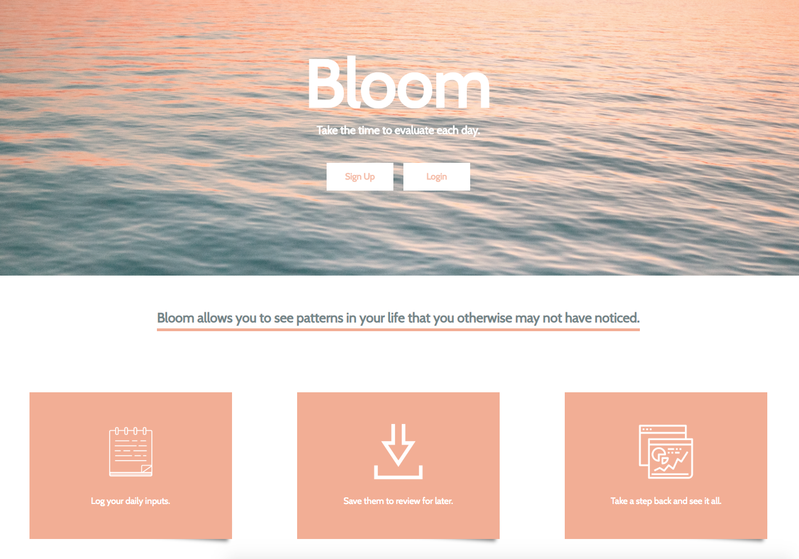
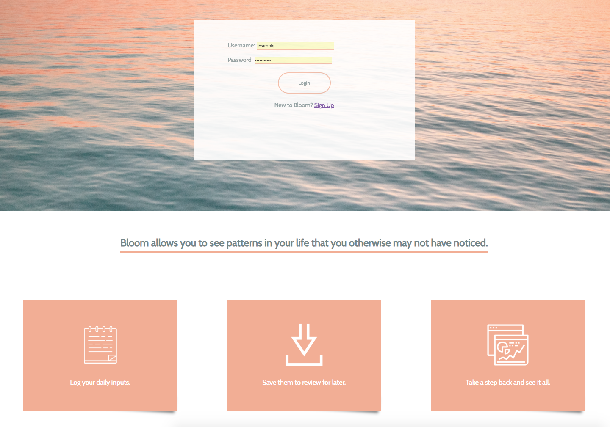
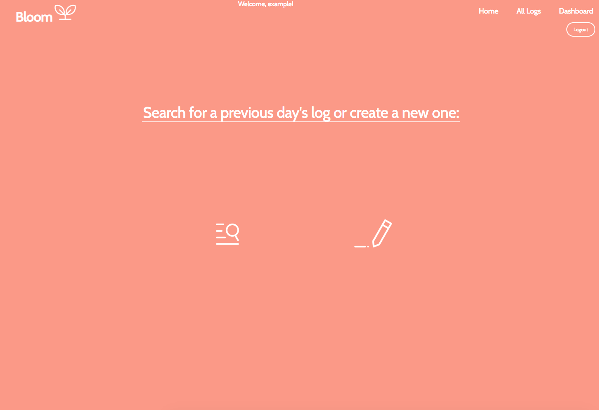
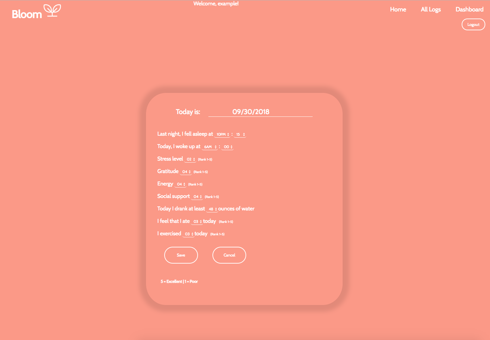
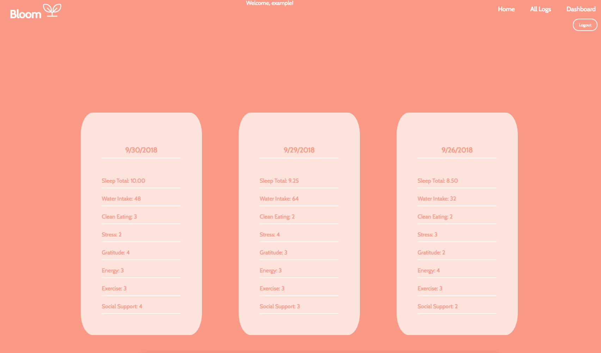
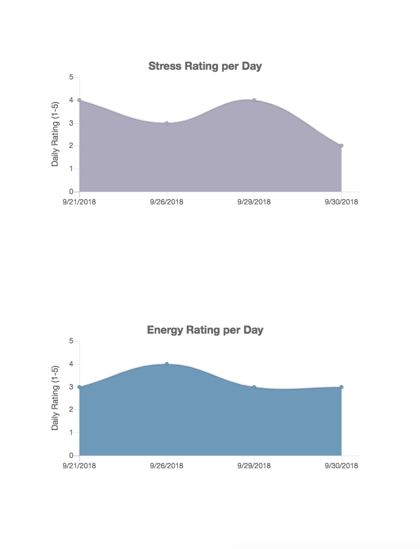
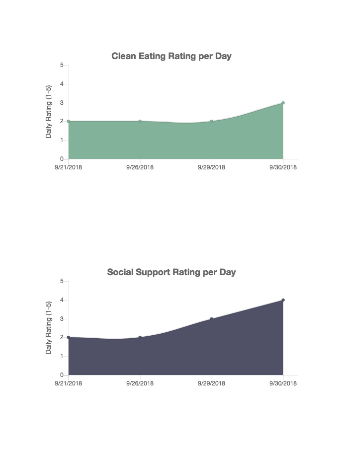

# Bloom

Bloom is a health and wellness app that was inspired by a form of journaling called Bullet Journaling. Bloom allows you to track different areas in your life that are considered to be integral in maintaining a positive lifestyle. 

Using a log form, you will be able to submit a form for each day. If you get misjudged a day, feel free to edit the log. If you want to completely delete one, that's not an issue - we've built in that feature.

Once you have a few logs, take advantage of the dashboards page which will graphically display each of your logs by day with the hopes of showing you a trend that you may not have noticed. 

# Screenshots from Bloom

Bloom's landing page

Once you've signed up, you can go ahead and login to your Bloom profile

From there, you'll be given the choice to either create a log or view any of your previous logs

Below is what it looks like when you create a new log. You'll be given a series of options to rate how your day is going, as well as some factual info like sleep duration and water intake.

Once you've entered a log for the day, you can either take a look at all of your logs or view the dashboard page to see how you're doing from a visual perspective. 

