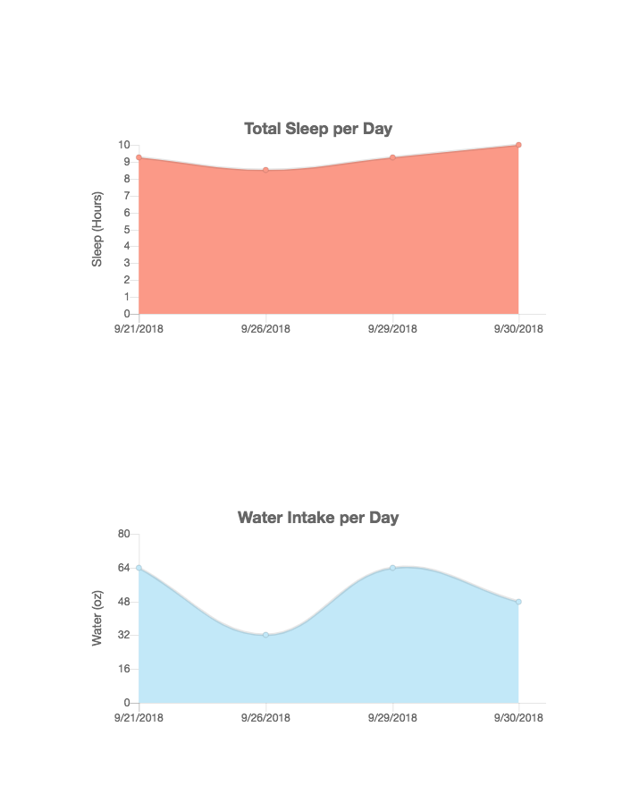

# Bloom

Bloom is a health and wellness app that was inspired by a form of journaling called Bullet Journaling. Bloom allows you to track different areas in your life that are considered to be integral in maintaining a positive lifestyle. 

Using a log form, you will be able to submit a form for each day. If you get misjudged a day, feel free to edit the log. If you want to completely delete one, that's not an issue - we've built in that feature.

Once you have a few logs, take advantage of the dashboards page which will graphically display each of your logs by day with the hopes of showing you a trend that you may not have noticed. 

# Live Demo
The app is hosted on Heroku: <a href = "https://bloomappthinkful.herokuapp.com">Live Demo</a>
    
# Technologies
<ul>
<li>Node</li>
<li>Express</li>
<li>MongoDB</li>
<li>Mongoose</li>
<li>Passport</li>
<li>JWT</li>
<li>Travis</li>
<li>mLab</li>
<li>REST APIs</li>
<li>Mocha</li>
<li>Chai</li>
<li>Javascript</li>
<li>JQuery</li>
<li>CSS</li>
<li>HTML</li>
    
    
# Screenshots from Bloom

<h2>Landing page</h2>

<h2>Login page</h2>

<h2>View or Create a Log</h2>

<h2>Create a Log</h2>

<h2>View All / Dashbard Page</h2>

